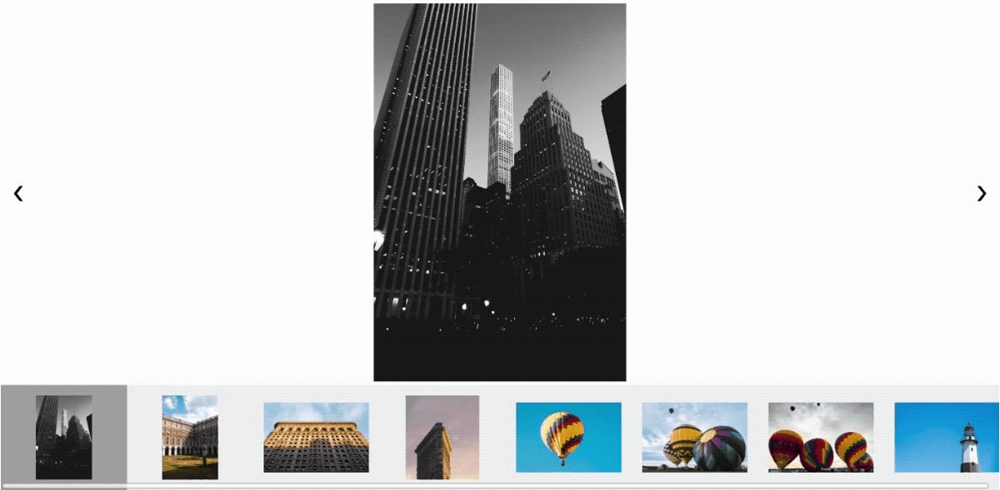

# image-viewer
Image viewer created with [Druid](https://github.com/linebender/druid).

## Demo
[This link](https://arthmis.github.io/projects/#photo-gallery) will show you a demo of the current photo gallery.

Example:


This has so far only been tested on Windows 10 and Ubuntu 18.04. It would be great if anyone could test
on MacOS to see if there are any issues. 

## Build & Run
You will need to install [Rust](https://www.rust-lang.org/) in order to run this project. These are the [installation instructions](https://www.rust-lang.org/learn/get-started).

To run the project, type this in your terminal:

```
cargo run --release
```

This will build the project and start the application.

 